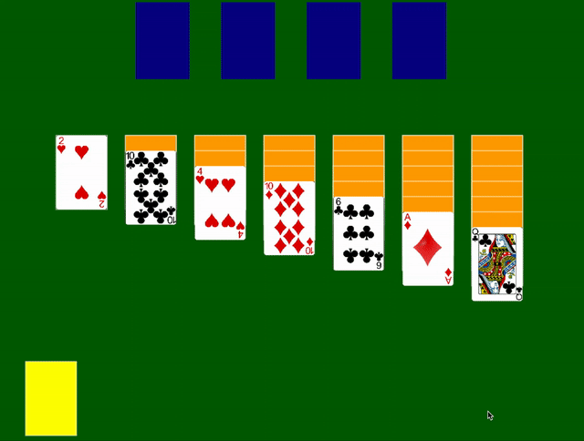

# simple-solitaire
A simple working clone of Solitaire using nothing but Vanilla JS, the Canvas API and a simple Rollup setup.

I do not own the playing cards assets, they were taken from [this](https://opengameart.org/content/playing-cards-vector-png) entry on OpenGameArt.org.
